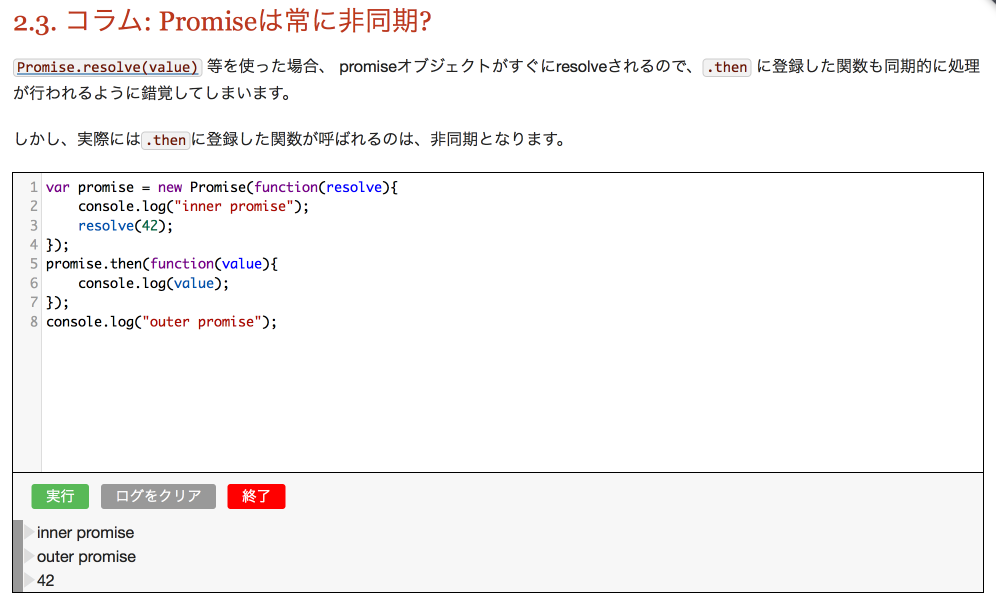
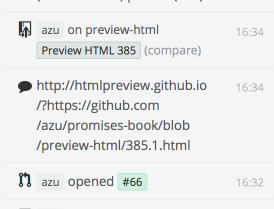

[[tooling-ci]]
== 執筆のために作成したツール

この書籍を書いている最中に開発した生成ツールやTravis CIと連携したテストについて。

=== HTML/Asciidoc

==== 表示用JavaScriptの生成

書籍のサンプルコードは外部ファイルにしたかった。
しかし、そのまま読み込む使い方だと、サンプルコードのモジュール化が難しくなってしまった。
モジュール化が上手くできないとテストを書くことが難しくなる。
そこで、サンプルコード(`src`)と表示用コード(`embed`)にわけることにした。

そのために、サンプルコードから表示用コードを生成するモジュールを書いた。

- https://github.com/azu/inlining-node-require[azu/inlining-node-require]
- https://github.com/azu/remove-use-strict[azu/remove-use-strict]

Browserify等の既存のモジュールビルドツールでは `require` のエミュレートをするコードが入るため、
結合したコードがあまりキレイではない。

そこで作成したのが __inlining-node-require__ でCommonJSのコードを見た目そのままに結合をすることができる。

[NOTE]
====
__inlining-node-require__ は見た目はキレイに結合するが、
あらゆるパターンに対応することはできないため、ある程度の制限を持った書き方が必要になる。
====

サンプルコードは `"use strict"` を使ったコードとなっているが、
__inlining-node-require__ で結合した際に重複することや表示用コードではスペース的に余計なものとなる。
__remove-use-strict__ は不必要な `"use strict"` を取り除くことができるツール。

動作の詳細については下記の記事で紹介している。

- http://efcl.info/2014/0316/res3719/[Node.jsのrequireをインライン化、無駄なuse strictを取り除くモジュールを書いた | Web scratch]

==== サンプルコードの実行エディタ

Webで公開する書籍のメリットとして、その場でコードの実行結果が見られることが大きい。
書籍やウェブでの連載でもJSFiddle等のコード公開へのリンクを貼ったものが増えてきている。

そのため、サンプルコードがその場で実行できるのはメリットでありつつ、必要不可欠なものである。

日本語に対応したJavaScriptのコードエディタとしては http://codemirror.net/[CodeMirror] が良くできているため、
CodeMirrorをベースにコードの実行機能を付加するモジュールを作成した。

- https://github.com/azu/codemirror-console[azu/codemirror-console]
- https://github.com/azu/codemirror-console-ui[azu/codemirror-console-ui]

__codemirror-console__ はCodeMirrorに書かれているコードを実行出来るモジュール。
単純にコードをevalするだけでは、グロールスコープを汚染してしまうため、
コードを実行する時にiframeを作り、その中でコードを実行している。

http://nodejs.org/api/vm.html[Nodeのvmモジュール]と似た考え方を持つ https://github.com/amasad/context-eval/[context-eval]を利用した。
これにより単純に実行するだけではなく、`console` を独自のものとすり替えて実行することができるようになっている。

__codemirror-console-ui__は__codemirror-console__のUIを提供するモジュール。

__codemirror-console__は実行する機能のみであるため、UIは別モジュールとして作成した。

- https://github.com/azu/promises-book/issues/18
- https://github.com/azu/promises-book/pull/121

=== Testing

==== サンプルコードのテスト

サンプルコードはNode.js上で動くものとして作り、Node.jsで動くテストを書いた。

<<es6-promises,ES6 Promises>>はDOMではなくECMAScriptの仕様であるため、
ブラウザが実行環境ではなくてもよいという考えと、実行の手軽さからNode.js上で動くものとして書いていった。

しかし一部を除いて、表示用コードはブラウザでの表示と実行を前提としている。
サンプルコードから表示用コードを自動的に生成しているが、
これはモジュールに関する事のみを解決するため、サンプルコードはどちらの環境でも動く書き方が必要となった。

Node.js上でもブラウザと同様の機能がテスト出来るようにするためのPolyfillやモックが必要となった。
DOM APIが中心となり、具体的には `XMLHttpRequest` や `Notification` 等が該当する。

===== XHR

Node.jsには `XMLHttpRequest` がないため、`XMLHttpRequest` と同じインターフェイスを持った
HTTP通信ライブラリが必要となる。

この書籍では w3c-xmlhttprequest を使い、
Node.jsでも `XMLHttpRequest` と同じインターフェイスで通信をするコードを書くことができた。

[NOTE]
====
`XMLHttpRequest` と同じインターフェイスをNode.jsに提供するライブラリには以下のようなものがある。

* https://github.com/ykzts/node-xmlhttprequest[ykzts/node-xmlhttprequest]
* https://github.com/driverdan/node-XMLHttpRequest[driverdan/node-XMLHttpRequest]
* https://github.com/pwnall/node-xhr2[pwnall/node-xhr2]

どのライブラリも `XMLHttpRequest` の全ての機能が使えるわけではないため、
用途に合わせたものを選ぶ必要がある。
====

このライブラリをテスト実行前に、`global` に追加することで、
ブラウザとNode.jsで同様のコードを動かせるようにした。

[source,javascript]
----
global.XMLHttpRequest = require('w3c-xmlhttprequest').XMLHttpRequest;
----

[NOTE]
====
詳細は以下で紹介されている

* http://azu.github.io/slide/hasakurajs/[Test Runner Tips]
====

===== Web Notifications API

テスト出来るようにすることが目的であるため、機能まで持ってくる必要性はなかった。
そのため、Web Notifications APIではNoticationのモックオブジェクトを作成し、テストを行った。

- https://github.com/azu/promises-book/blob/master/Ch4_AdvancedPromises/test/mock/mock-notification.js[mock-notification.js]

==== 出力したHTMLのテスト

Asciidocでは `<<id>>` という記法で内部リンクを貼ることができるが、
この内部リンク先をリファクタリング時に変更してしまうことがあった。

そのため、生成したHTMLから内部リンクを取得して、移動先となる要素が
確かに存在するのかをテストするスクリプトを走らせている。

- https://github.com/azu/promises-book/issues/25

==== Asciidoc上のインラインコードテスト

この書籍中のコードには大きく分けて2種類ある。
ひとつは外部ファイルとして書いてテストも書いているサンプルコード。
もう一つは直接Asciidocのファイルに書いているインラインコードである。

外部ファイルのサンプルコードはテストしているため動作に問題ないことを保証できるが、
インラインコードは直接書くため実行して確認せず間違ったコードを書いてしまいがちだった。

そのため、Asciidocのファイルをパースして、インラインコードを抽出し、
そのコードが http://esprima.org/[Esprima]といったJavaScriptパーサでパース出来るかを検証できるようにした。

これによりJavaScriptの文法として間違っているものはパースエラーとなるため、
インラインに書いたコードのミスを検出するのに役立った。

- https://github.com/azu/promises-book/issues/52

==== Asciidoctorのビルドテスト

この書籍はAsciidoc形式で書き、asciidoctorによりビルドしている。

Asciidoctorではリソースが欠損しててもエラーではなくWARNINGとなるため、ビルドするときにWARNINGが発生したらCIが落ちるようにした。

- https://github.com/azu/promises-book/issues/54

=== Review

==== プレビュー

masterへマージされたものは、Travis CIで自動的にビルドして `gh-pages` ブランチにpushする。
これによりmasterへのコミットやpull-requestsをマージしたら自動的に http://azu.github.io/promises-book/ にて見られるようにしていた。

- https://github.com/azu/promises-book/blob/master/_tools/deploy-gh-pages.sh[promises-book/_tools/deploy-gh-pages.sh at master · azu/promises-book]

pull-requestsのコミットに対しては、そのコミットごとに `preview-html` ブランチに生成済みのHTMLがpushされる。

pushされた一時プレビュー用のURLをGitterに対して通知して、pull-request時のHTMLがプレビュー出来るようになっている。

- https://github.com/azu/promises-book/blob/master/_tools/deploy-preview-html.sh[promises-book/_tools/deploy-preview-html.sh at master · azu/promises-book]

=== 依存関係の可視化

- https://github.com/azu/visualize-promises-book[azu/visualize-promises-book]

セクション毎にテーマを分けてる事が多いが、それを俯瞰的にどうやってみるかを模索するために、
セクション同士の依存関係を可視化するものを作成した。

=== Lint

https://gist.github.com/inao/f55e8232e150aee918b9[WEB+DB PRESS用語統一ルール] の辞書を使うために、
辞書のパーサーを書いた。

- https://github.com/azu/wzeditor-word-rules-parser[azu/wzeditor-word-rules-parser]
- http://efcl.info/2014/0616/res3931/[WEB+DB PRESS用語統一ルール(WZEditor)のパーサを書いた | Web scratch]
