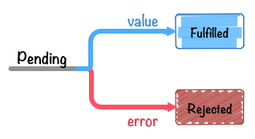

[[promises-overview]]
== Promise Overview

<<es-promises,ES Promises>>の仕様で定義されているAPIはそこまで多くはありません。

大きく分けて以下の3種類になります。

*Constructor*

Promiseは `XMLHttpRequest` のように、コンストラクタ関数である `Promise` からインスタンスとなる
promiseオブジェクトを作成して利用します。

promiseオブジェクトを作成するには、`Promise` コンストラクタを `new` でインスタンス化します。

[source,javascript]
----
const promise = new Promise((resolve, reject) => {
    // 非同期の処理
    // 処理が終わったら、resolve または rejectを呼ぶ
});
----

*Instance Method*

newによって生成されたpromiseオブジェクトにはpromiseの値を *resolve*(成功) / *reject*(失敗) した時に呼ばれる
コールバック関数を登録するために `promise.then()` というインスタンスメソッドがあります。

[source,javascript]
----
promise.then(onFulfilled, onRejected);
----

resolve(成功)した時::
    `onFulfilled` が呼ばれる
reject(失敗)した時::
    `onRejected`  が呼ばれる

`onFulfilled`、`onRejected` どちらもオプショナルな引数となっています。

`promise.then` では成功時と失敗時の処理を同時に登録することができます。
また、エラー処理だけを書きたい場合には `promise.then(undefined, onRejected)` と同じ意味である
`promise.catch(onRejected)` を使うことができます。

[source,javascript]
promise.catch(onRejected);

*Static Method*

`Promise` というグローバルオブジェクトには幾つかの静的なメソッドが存在します。

`Promise.all()` や `Promise.resolve()` などが該当し、Promiseを扱う上での補助メソッドが中心となっています。

=== Promise workflow

以下のようなサンプルコードを見てみましょう。

[role="executable"]
[source,javascript]
[[promise-workflow.js]]
.promise-workflow.js
----
include::embed/embed-promise-workflow.js[]
----
<1> Promiseコンストラクタを `new` して、promiseオブジェクトを返します
<2> <1>のpromiseオブジェクトに対して `.then` で値が返ってきた時のコールバックを設定します

`asyncFunction` という関数 は promiseオブジェクトを返していて、
そのpromiseオブジェクトに対して `then` でresolveした時のコールバックを、
`catch` でエラーとなった場合のコールバックを設定しています。

このpromiseオブジェクトはsetTimeoutで16ms後にresolveされるので、
そのタイミングで `then` のコールバックが呼ばれ `'Async Hello world'` と出力されます。

この場合 `catch` のコールバックは呼ばれることはないですが、
`setTimeout` が存在しない環境などでは、例外が発生し `catch` で登録したコールバック関数が呼ばれると思います。

もちろん、`promise.then(onFulfilled, onRejected)` というように、
`catch` を使わずに `then` を使い、以下のように2つのコールバック関数を設定することでもほぼ同様の動作になります。

[source,javascript]
----
asyncFunction().then((value) => {
    console.log(value);
}, (error) => {
    console.error(error);
});
----

=== Promiseの状態 [[promise-states]]

Promiseの処理の流れが少しわかった所で、Promiseの状態について整理したいと思います。

`new Promise` でインスタンス化したpromiseオブジェクトには以下の3つの状態が存在します。

Fulfilled::
    resolve(成功)した時。このとき `onFulfilled` が呼ばれる
Rejected::
    reject(失敗)した時。このとき `onRejected`  が呼ばれる
Pending::
    FulfilledまたはRejectedではない時。つまりpromiseオブジェクトが作成された初期状態等が該当する

これらの状態は<<es-promises,ES Promises>>の仕様で定められている名前です。
この状態をプログラムで直接触る方法は用意されていないため、書く際には余り気にしなくても問題ないですが、
Promiseについて理解するのに役に立ちます。

この書籍では、__Pending__、__Fulfilled__ 、__Rejected__ の状態を用いて解説していきます。

.promise states

[NOTE]
====
<<es-promises,ES Promisesの仕様>> では `+++[[PromiseStatus]]+++` という内部定義によって状態が定められています。
`+++[[PromiseStatus]]+++` にアクセスするユーザーAPIは用意されていないため、基本的には知る方法はありません。
====

3つの状態を見たところで、すでにこの章で全ての状態が出てきていることが分かります。

promiseオブジェクトの状態は、一度__Pending__から__Fulfilled__や__Rejected__になると、
そのpromiseオブジェクトの状態はそれ以降変化することはなくなります。

つまり、PromiseはEvent等とは違い、`.then` で登録した関数が呼ばれるのは1回限りということが明確になっています。

また、__Fulfilled__と__Rejected__のどちらかの状態であることを**Settled**(不変の)と表現することがあります。

Settled::
    resolve(成功) または reject(失敗) した時。

__Pending__と__Settled__が対となる関係であると考えると、Promiseの状態の種類/遷移がシンプルであることが分かると思います。

このpromiseオブジェクトの状態が変化した時に、一度だけ呼ばれる関数を登録するのが `.then` といったメソッドとなるわけです。

[NOTE]
====
https://speakerdeck.com/kerrick/javascript-promises-thinking-sync-in-an-async-world[JavaScript Promises - Thinking Sync in an Async World // Speaker Deck]
というスライドではPromiseの状態遷移について分かりやすく書かれています。
====

