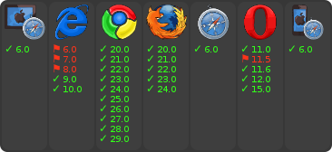

[[ch2-promise-catch]]
== Promise#catch

<<ch2-promise.then, 先ほどのPromise#then>>についてでも `Promise#catch` はすでに使っていましたね。

改めて説明すると<<promise.catch,Promise#catch>>は `promise.then(undefined, onRejected);` のエイリアスとなるメソッドです。
つまり、promiseオブジェクトがRejectedとなった時に呼ばれる関数を登録するためのメソッドです。

次のコードのように ``Promise#catch`` は ``Promise#then`` でのエラーハンドリングだけを簡潔に書くためのメソッドです。

[source,javascript]
.Promise#catchとPromise#then
----
Promise.reject(new Error("message")).catch((error) => {
    // エラーハンドリング
});
// Promise#catchは次のPromise#thenと同じ意味
Promise.reject(new Error("message")).then(undefined, (error) => {
    // エラーハンドリング
});
----

[NOTE]
<<promise.then,Promise#then>>と<<promise.catch,Promise#catch>>の使い分けについては、
<<then-or-catch,then or catch?>>で紹介しています。

=== IE8以下での問題

このバッジは以下のコードが、 https://github.com/jakearchibald/es6-promise[polyfill] を用いた状態でそれぞれのブラウザで正しく実行できているかを示したものです。

[NOTE]
====
polyfillとはその機能が実装されていないブラウザでも、その機能が使えるようにするライブラリのことです。
この例では https://github.com/jakearchibald/es6-promise[jakearchibald/es6-promise] を利用しています。
====

[role="executable"]
[source,javascript]
.Promise#catchの実行結果
----
const promise = Promise.reject(new Error("message"));
promise.catch((error) => {
    console.error(error);
});
----

このコードをそれぞれのブラウザで実行させると、IE8以下では実行する段階で **識別子がありません** というSyntax Errorになってしまいます。

これはどういうことかというと、`catch` という単語はECMAScriptにおける http://mothereff.in/js-properties#catch[予約語] であることが関係します。

ECMAScript 3では予約語はプロパティの名前に使うことができませんでした。
IE8以下はECMAScript 3の実装であるため、`catch` というプロパティを使う `promise.catch()` という書き方が出来ないので、
**識別子がありません**というエラーを起こしてしまう訳です。

一方、現在のブラウザが実装済みであるECMAScript 5以降では、
予約語を http://es5.github.io/#x7.6[IdentifierName] 、つまりプロパティ名に利用することが可能となっています。

[NOTE]
====
ECMAScript 5でも予約語は http://es5.github.io/#x7.6[Identifier] 、つまり変数名、関数名には利用することができません。
`for` という変数が定義できてしまうと `for` 文との区別ができなくなってしまいます。
プロパティの場合は `object.for` と `for` 文の区別はできるので、少し考えてみると自然な動作ですね。
====

このECMAScript 3の予約語の問題を回避する書き方も存在します。

https://developer.mozilla.org/ja/docs/Web/JavaScript/Reference/Operators/Property_Accessors#Dot_notation[ドット表記法]
はプロパティ名が有効な識別子(ECMAScript 3の場合は予約語が使えない)でないといけませんが、
https://developer.mozilla.org/ja/docs/Web/JavaScript/Reference/Operators/Property_Accessors#Bracket_notation[ブラケット表記法]
は有効な識別子ではなくても利用できます。

つまり、先ほどのコードは以下のように書き換えれば、IE8以下でも実行することができます。(もちろんpolyfillは必要です)

[role="executable"]
[source,javascript]
.Promise#catchの識別子エラーの回避
----
const promise = Promise.reject(new Error("message"));
promise["catch"]((error) => {
    console.error(error);
});
----

もしくは単純に `catch` を使わずに、`then` を使うことでも回避できます。

[role="executable"]
[source,javascript]
.Promise#catchではなくPromise#thenを使う
----
const promise = Promise.reject(new Error("message"));
promise.then(undefined, (error) => {
    console.error(error);
});
----

`catch` という識別子が問題となっているため、ライブラリによっては `caught` 等の名前が違うだけのメソッドを用意しているケースがあります。

また多くの圧縮ツールは `promise.catch` を `promise["catch"]` へと置換する処理が組み込まれているため、知らない間に回避できていることも多いかも知れません。

サポートブラウザにIE8以下を含める時は、この `catch` の問題に気をつけるといいでしょう。
