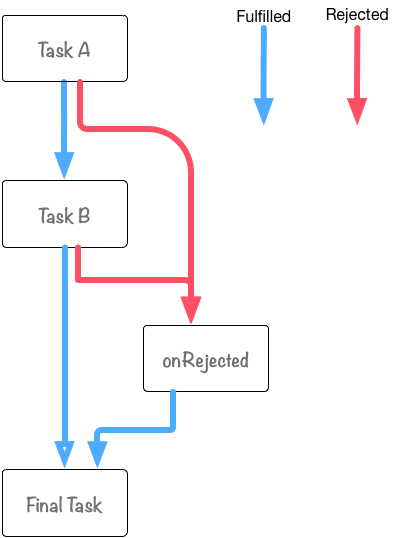
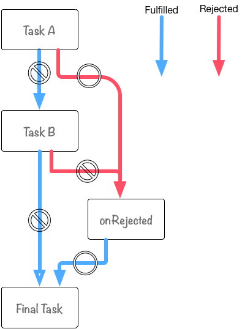
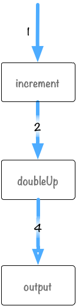

[[ch2-promise.then]]
== Promise#then

先ほどの章でPromiseの基本となるインスタンスメソッドである `then` と `catch` の使い方を説明しました。

その中で `.then().catch()` とメソッドチェーンで繋げて書いていたことからも分かるように、
Promiseではいくらでもメソッドチェーンを繋げて処理を書いていくことができます。

[source,javascript]
.promiseはメソッドチェーンで繋げて書ける
----
aPromise.then((value) => {
// task A
}).then((value) => {
// task B
}).catch((error) => {
    console.error(error);
});
----

`then` で登録するコールバック関数をそれぞれtaskというものにした時に、
taskA -> task B という流れをPromiseのメソッドチェーンを使って書くことができます。

Promiseのメソッドチェーンだと長いので、今後は<<promise-chain,promise chain>>と呼びます。
このpromise chainがPromiseが非同期処理の流れを書きやすい理由の一つといえるかもしれません。

このセクションでは、`then` を使ったpromise chainの挙動と流れについて学んでいきましょう。

=== promise chain

第一章の例だと、<<promise-chain,promise chain>>は
then -> catch というシンプルな例でしたが、このpromise chainをもっとつなげた場合に、
それぞれのpromiseオブジェクトに登録された onFulfilledとonRejectedがどのように呼ばれるかを見ていきましょう。

[NOTE]
promise chain - すなわちメソッドチェーンが短いことはよいことです。
この例では説明のために長いメソッドチェーンを用います。

次のようなpromise chainを見てみましょう。

[role="executable"]
[source,javascript]
[[promise-then-catch-flow.js]]
.promise-then-catch-flow.js
----
include::src/promise-then-catch-flow.js[]
----

このようなpromise chainをつなげた場合、
それぞれの処理の流れは以下のように図で表せます。

[[promise-then-catch-flow.png]]
.promise-then-catch-flow.jsの図

<<promise-then-catch-flow.js,上記のコード>>では `then` は第二引数(onRejected)を使っていないため、
以下のように読み替えても問題ありません。

`then`::
    onFulfilledの処理を登録
`catch`::
    onRejectedの処理を登録

<<promise-then-catch-flow.png,図>>の方に注目してもらうと、
__Task A__ と __Task B__ それぞれから __onRejected__ への線が出ていることが分かります。

これは、__Task A__ または __Task B__ の処理にて、次のような場合に __onRejected__ が呼ばれるということを示しています。

* 例外が発生した時
* Rejectedなpromiseオブジェクトがreturnされた時

<<how-to-write-promise,第一章>>でPromiseの処理は常に `try-catch` されているようなものなので、
例外が起きた場合もキャッチして、`catch` で登録された `onRejected` の処理を呼ぶことは学びましたね。

もう一つの __Rejectedなpromiseオブジェクトがreturnされた時__ については、
`throw` を使わずにpromise chain中に `onRejected` を呼ぶ方法です。

これについては、ここでは必要ない内容なので詳しくは、 第4章の <<not-throw-use-reject, throwしないで、rejectしよう>> にて解説しています。

また、__onRejected__ と __Final Task__ には `catch` のpromise chainがこれより後ろにありません。
つまり、この処理中に例外が起きた場合はキャッチすることができないことに気をつけましょう。

もう少し具体的に、__Task A__ -> __onRejected__ となる例を見てみます。

==== Task Aで例外が発生したケース

__Task A__ の処理中に例外が発生した場合、
TaskA -> onRejected -> FinalTask という流れで処理が行われます。

.Task Aで例外が発生した時の図

コードにしてみると以下のようになります。

[role="executable"]
[source,javascript]
[[promise-then-taska-throw.js]]
.promise-then-taska-throw.js
----
include::src/promise-then-taska-throw.js[]
----

実行してみると、__Task B__ が呼ばれていないことが分かるでしょう。

[NOTE]
====
例では説明のためにtaskAで `throw` して例外を発生させています。
しかし、実際に明示的にonRejectedを呼びたい場合は、Rejectedなpromiseオブジェクトを返すべきでしょう。
それぞれの違いについては <<not-throw-use-reject, throwしないで、rejectしよう>> で解説しています。
====

=== promise chainでの値渡し

先ほどの例ではそれぞれのTaskが独立していて、ただ呼ばれているだけでした。

このときに、Task AがTask Bへ値を渡したい時はどうすればよいでしょうか?

答えはものすごく単純でTask Aの処理で `return` した値がTask Bが呼ばれるときに引数に設定されます。

実際に例を見てみましょう。

[role="executable"]
[source,javascript]
[[promise-then-passing-value.js]]
.promise-then-passing-value.js
----
include::src/promise-then-passing-value.js[]
----

スタートは `Promise.resolve(1);` で、この処理は以下のような流れでpromise chainが処理されていきます。

. `Promise.resolve(1);` から 1 が `increment` に渡される
. `increment` では渡された値に+1した値を `return` している
. この値(2)が次の `doubleUp` に渡される
. 最後に `output` が出力する

.promise-then-passing-value.jsの図

この `return` する値は数字や文字列だけではなく、
オブジェクトやpromiseオブジェクトも `return` することができます。

returnした値は `Promise.resolve(returnされた値);` のように処理されるため、
何をreturnしても最終的には新しいpromiseオブジェクトを返します。

[NOTE]
これについて詳しくは <<then-return-new-promise,thenは常に新しいpromiseオブジェクトを返す>> にて、
よくある間違いと共に紹介しています。

つまり、 `Promise#then` は単にコールバックとなる関数を登録するだけではなく、
受け取った値を変化させて別のpromiseオブジェクトを生成する という機能も持っていることを覚えておくといいでしょう。

