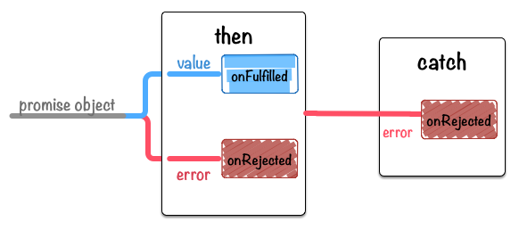

[[then-return-new-promise]]
== コラム: thenは常に新しいpromiseオブジェクトを返す

`aPromise.then(...).catch(...)` は一見すると、全て最初の `aPromise` オブジェクトに
メソッドチェーンで処理を書いてるように見えます。

しかし、実際には `then` で新しいpromiseオブジェクト、`catch` でも別の新しいpromiseオブジェクトを作成して返しています。

本当に新しいpromiseオブジェクトを返しているのか確認してみましょう。

[role="executable"]
[source,javascript]
----
const aPromise = new Promise((resolve) => {
    resolve(100);
});
const thenPromise = aPromise.then((value) => {
    console.log(value);
});
const catchPromise = thenPromise.catch((error) => {
    console.error(error);
});
console.log(aPromise !== thenPromise); // => true
console.log(thenPromise !== catchPromise);// => true
----

`===` 厳密比較演算子によって比較するとそれぞれが別々のオブジェクトなので、
本当に `then` や `catch` は別のpromiseオブジェクトを返していることが分かりました。

この仕組みはPromiseを拡張する時は意識しないと、いつのまにか触ってるpromiseオブジェクトが
別のものであったということが起こりえると思います。

また、`then` は新しいオブジェクトを作って返すということがわかっていれば、
次の `then` の使い方では意味が異なることに気づくでしょう。

[role="executable"]
[source,javascript]
----
// 1: それぞれの `then` は同時に呼び出される
const aPromise = new Promise((resolve) => {
    resolve(100);
});
aPromise.then((value) => {
    return value * 2;
});
aPromise.then((value) => {
    return value * 2;
});
aPromise.then((value) => {
    console.log("1: " + value); // => 100
});

// vs

// 2: `then` はpromise chain通り順番に呼び出される
const bPromise = new Promise((resolve) => {
    resolve(100);
});
bPromise.then((value) => {
    return value * 2;
}).then((value) => {
    return value * 2;
}).then((value) => {
    console.log("2: " + value); // => 100 * 2 * 2
});
----

1のpromiseをメソッドチェーン的に繋げない書き方はあまりすべきではありませんが、
このような書き方をした場合、それぞれの `then` はほぼ同時に呼ばれ、また `value` に渡る値も全て同じ `100` となります。

2はメソッドチェーン的につなげて書くことにより、resolve -> then -> then -> then と書いた順番にキチンと実行され、
それぞれの `value` に渡る値は、一つ前のpromiseオブジェクトで `return` された値が渡ってくるようになります。

1の書き方により発生するアンチパターンとしては以下のようなものが有名です。

[source,javascript]
.✘ `then` の間違った使い方
----
function badAsyncCall() {
    const promise = Promise.resolve();
    promise.then(() => {
        // 何かの処理
        return newVar;
    });
    return promise;
}
----

このように書いてしまうと、`promise.then` の中で例外が発生するとその例外を取得する方法がなくなり、
また、何かの値を返していてもそれを受け取る方法が無くなってしまいます。

これは `promise.then` によって新たに作られたpromiseオブジェクトを返すようにすることで、
2のようにpromise chainをつなげるようにするべきなので、次のように修正することができます。

[source,javascript]
.`then` で作成したオブジェクトを返す
----
function anAsyncCall() {
    const promise = Promise.resolve();
    return promise.then(() => {
        // 何かの処理
        return newVar;
    });
}
----

これらのアンチパターンについて、詳しくは
https://web.archive.org/web/20211219034053/http://taoofcode.net/promise-anti-patterns/[Promise Anti-patterns] を参照して下さい。

この挙動はPromise全般に当てはまるため、後に説明する<<ch2-promise-all,Promise.all>>や<<ch2-promise-race,Promise.race>>も
引数で受け取ったものとは別のpromiseオブジェクトを作って返しています。
