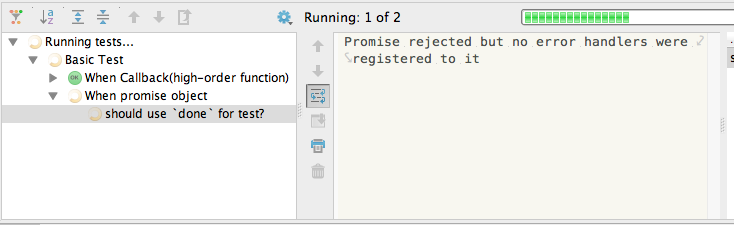

[[basic-tests]]
== 基本的なテスト

<<es-promises,ES Promises>>のメソッド等についてひととおり学ぶことができたため、
実際にPromiseを使った処理を書いていくことはできると思います。

そうした時に、次にどうすればいいのか悩むのがPromiseのテストの書き方です。

ここではまず、 https://mochajs.org/[Mocha]を使った基本的なPromiseのテストの書き方について学んでいきましょう。

また、この章でのテストコードはNode.js環境で実行することを前提としているため、
各自Node.js環境を用意してください。

[NOTE]
この書籍中に出てくるサンプルコードはそれぞれテストも書かれています。
テストコードは https://github.com/azu/promises-book[azu/promises-book] から参照できます。

=== Mochaとは

Mochaの公式サイト: https://mochajs.org/[https://mochajs.org/]

ここでは、 Mocha自体については詳しく解説しませんが、
MochaはNode.js製のテストフレームワークツールです。

MochaはBDD,TDD,exportsのどれかのスタイルを選択でき、テストに使うアサーションメソッドも任意のライブラリと組み合わせて利用します。
つまり、Mocha自体はテスト実行時の枠だけを提供しており、他は利用者が選択するというものになっています。

Mochaを選択した理由は、以下のとおりです。

* 著名なテストフレームワークであること
* Node.jsとブラウザ どちらのテストもサポートしている
* "Promiseのテスト"をサポートしている

最後の _"Promiseのテスト"をサポートしている_ とはどういうことなのかについては後ほど解説します。

この章ではMochaを利用するため、npmを使いMochaをインストールしておく必要があります。

[source,console]
----
$ npm install -g mocha
----

また、アサーション自体はNode.jsに同梱されている `assert` モジュールを使用するので別途インストールは必要ありません。

まずはコールバックスタイルの非同期処理をテストしてみましょう。

=== コールバックスタイルのテスト

コールバックスタイルの非同期処理をテストする場合、Mochaでは以下のように書くことができます。

[source,javascript]
.basic-test.js
----
include::embed/embed-basic-test.js[]
----

このテストを `basic-test.js` というファイル名で作成し、
先ほどインストールしたMochaでコマンドラインからテストを実行することができます。

[source,sh]
----
$ mocha basic-test.js
----

Mochaは `it` の仮引数に `done` のように指定してあげると、
`done()` が呼ばれるまでテストの終了を待つことで非同期のテストをサポートしています。

Mochaでの非同期テストは以下のような流れで実行されます。

[source,javascript]
[[callback-style-test]]
----
it("should use `done` for test", (done) => {
    // <1>
    setTimeout(() => {
        assert(true);
        done();// <2>
    }, 0);
});
----
<1> コールバックを使う非同期処理
<2> `done` を呼ぶことでテストが終了する

よく見かける形の書き方ですね。

[[done-promise-test]]
=== `done` を使ったPromiseのテスト

次に、同じく `done` を使ったPromiseのテストを書いてみましょう。

[source,javascript]
----
it("should use `done` for test?", (done) => {
    const promise = Promise.resolve(42);// <1>
    promise.then((value) => {
        assert(value === 42);
        done();// <2>
    });
});
----
<1> `Fulfilled` となるpromiseオブジェクトを作成
<2> `done` を呼ぶことでテストの終了を宣言

<<Promise.resolve, `Promise.resolve`>> はpromiseオブジェクトを返しますが、
そのpromiseオブジェクトはFulfilledの状態になります。
その結果として `.then` で登録したコールバック関数が呼び出されます。

<<promise-is-always-async,コラム: Promiseは常に非同期?>> でも出てきたように、
promiseオブジェクトは常に非同期で処理されるため、テストも非同期に対応した書き方が必要となります。

しかし、先ほどのテストコードでは `assert` が失敗した場合に問題が発生します。

[source,javascript]
[[promise-assert-fail]]
.意図しない結果となるPromiseのテスト
----
it("should use `done` for test?", (done) => {
    const promise = Promise.resolve();
    promise.then((value) => {
        assert(false);// => throw AssertionError
        done();
    });
});
----

このテストは `assert` が失敗しているため、「テストは失敗する」と思うかもしれませんが、
実際にはテストが終わることがなくタイムアウトします。

.テストが終わることがないためタイムアウトするまでそこで止まる

`assert` が失敗した場合は通常はエラーをthrowし、
テストフレームワークがそれをキャッチすることで、テストが失敗したと判断します。

しかし、Promiseの場合は `.then` の中で行われた処理でエラーが発生しても、
Promiseがそれをキャッチしてしまい、テストフレームワークまでエラーが届きません。

<<promise-assert-fail, 意図しない結果となるPromiseのテスト>>を改善して、
`assert` が失敗した場合にちゃんとテストが失敗となるようにしてみましょう。

[source,javascript]
[[promise-assert-fail-fixed]]
.意図通りにテストが失敗する例
----
it("should use `done` for test?", (done) => {
    const promise = Promise.resolve();
    promise.then((value) => {
        assert(false);
    }).then(done, done);
});
----

ちゃんとテストが失敗する例では、必ず `done` が呼ばれるようにするため、
最後に `.then(done, done);` を追加しています。

`assert` がパスした場合は単純に `done()` が呼ばれ、`assert` が失敗した場合は `done(error)` が呼ばれます。

これでようやく<<callback-style-test,コールバックスタイルのテスト>>と同等のPromiseのテストを書くことができました。

しかし、`assert` が失敗した時のために `.then(done, done);` というものを付ける必要があります。
Promiseのテストを書くときにつけ忘れてしまうと終わらないテストができ上がってしまう場合があることに気をつけましょう。

次に、最初にmochaを使う理由に上げた"Promisesのテスト"のサポートがどのような機能であるか学んでいきましょう。
