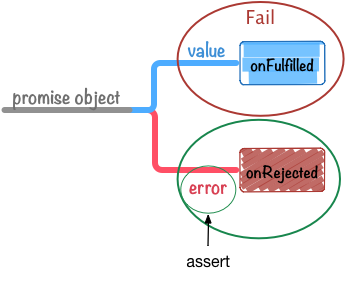

[[controllable-tests]]
== 意図したテストを書くには

ここでいう意図したテストとは以下のような定義で進めます。

あるpromiseオブジェクトをテスト対象として

* Fulfilledされることを期待したテストを書いた時
** Rejectedとなった場合は**Fail**
** assertionの結果が一致しなかった場合は**Fail**
* Rejectedされることを期待したテストを書いた時
** Fulfilledとなった場合は**Fail**
** assertionの結果が一致しなかった場合は**Fail**

上記のケース(Fail)に該当しなければテストがパスするということですね。

つまり、ひとつのテストケースにおいて以下のことを書く必要があります。

* Fulfilled or Rejected どちらを期待するか
* assertionで渡された値のチェック

先ほどの `.then` を使ったコードはRejectedを期待したテストとなっていますね。

[source,javascript]
----
promise.then(failTest, (error) => {
    // assertでerrorをテストする
    assert(error instanceof Error);
});
----

=== どちらの状態になるかを明示する

意図したテストにするためには、<<promise-states,promiseの状態>>が
Fulfilled or Rejected どちらの状態になって欲しいかを明示する必要があります。

しかし、`.then` だと引数は省略可能なので、テストが落ちる条件を入れ忘れる可能性もあります。

そこで、promiseオブジェクトに期待する状態を明示できるヘルパー関数を定義してみましょう。

[NOTE]
====
ライブラリ化したものが https://github.com/azu/promise-test-helper[azu/promise-test-helper] にありますが、
今回はその場で簡単に定義して進めます。
====

まずは、先ほどの `.then` の例を元にonRejectedを期待してテストできる
`shouldRejected` というヘルパー関数を作ってみたいと思います。

[[shouldRejected-test.js]]
.shouldRejected-test.js
[source,javascript]
----
include::embed/embed-shouldRejected-test.js[]
----

`shouldRejected` にpromiseオブジェクトを渡すと、`catch` というメソッドをもつオブジェクトを返します。

この `catch` にはonRejectedで書くものと全く同じ使い方ができるので、
`catch` の中にassertionによるテストを書けるようになっています。

`shouldRejected` で囲む以外は、通常のpromiseの処理と似た感じになるので以下のようになります。

. `shouldRejected` にテスト対象のpromiseオブジェクトを渡す
. 返ってきたオブジェクトの `catch` メソッドでonRejectedの処理を書く
. onRejectedにassertionによるテストを書く

`shouldRejected` を使った場合、Fulfilledが呼ばれるとエラーをthrowしてテストが失敗するようになっています。

[source,javascript]
----
promise.then(failTest, (error) => {
    assert(error.message === "human error");
});
// == ほぼ同様の意味
shouldRejected(promise).catch((error) => {
    assert(error.message === "human error");
});
----

`shouldRejected` のようなヘルパー関数を使うことで、テストコードが少し直感的になりましたね。

.Promise onRejected test

同様に、promiseオブジェクトがFulfilledになることを期待する `shouldFulfilled` も書いてみましょう。

[[shouldFulfilled-test.js]]
.shouldFulfilled-test.js
[source,javascript]
----
include::embed/embed-shouldFulfilled-test.js[]
----

<<shouldRejected-test.js>>と基本は同じで、返すオブジェクトの `catch` が `then` になって中身が逆転しただけですね。

=== まとめ

Promiseで意図したテストを書くためにはどうするか、またそれを補助するヘルパー関数について学びました。

[NOTE]
====
今回書いた `shouldFulfilled` と `shouldRejected` はライブラリとして利用できるようになっています。

https://github.com/azu/promise-test-helper[azu/promise-test-helper] からダウンロードすることができます。

また、Node.js 10.0.0から ``assert.rejects`` と ``assert.doesNotReject`` というよく似た趣旨のassertionが提供されています。
詳細は、 https://nodejs.org/api/assert.html[Node.jsのAPIドキュメント]を参照してください。
====

また、今回のヘルパー関数は<<mocha-promise,MochaのPromiseサポート>>を前提とした書き方なので、
<<done-promise-test,`done` を使ったテスト>>では利用しにくいと思います。

テストフレームワークのPromiseサポートを使うか、`done` のようにコールバックスタイルのテストを使うかは、
人それぞれのスタイルの問題であるためそこまではっきりした優劣はないと思います。

たとえば、 http://coffeescript.org/[CoffeeScript]でテストを書いたりすると、
CoffeeScriptには暗黙のreturnがあるので、`done` を使ったほうが分かりやすいかもしれません。

Promiseのテストは普通に非同期関数のテスト以上に落とし穴があるため、
どのスタイルを取るかは自由ですが、一貫性を持った書き方をすることが大切だといえます。