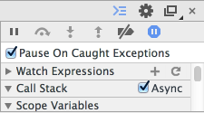

[[not-throw-use-reject]]
== throwしないで、rejectしよう

Promiseコンストラクタや、`then` で実行される関数は基本的に、
`try...catch` で囲まれてるような状態なので、その中で `throw` してもプログラムは終了しません。

Promiseの中で `throw` による例外が発生した場合は自動的に `try...catch` され、そのpromiseオブジェクトはRejectedとなります。

[role="executable"]
[source,javascript]
----
const promise = new Promise((resolve, reject) => {
    throw new Error("message");
});
promise.catch((error) => {
    console.error(error);// => "message"
});
----

このように書いても動作的には問題ありませんが、<<promise-states,promiseオブジェクトの状態>>をRejectedにしたい場合は
`reject` という与えられた関数を呼び出すのが一般的です。

先ほどのコードは以下のように書くことができます。

[role="executable"]
[source,javascript]
----
const promise = new Promise((resolve, reject) => {
    reject(new Error("message"));
});
promise.catch((error) => {
    console.error(error);// => "message"
});
----

`throw` が `reject` に変わったと考えれば、`reject` にはErrorオブジェクトを渡すべきであるということが分かりやすいかもしれません。

=== なぜrejectした方がいいのか

そもそも、promiseオブジェクトの状態をRejectedにしたい場合に、
なぜ `throw` ではなく `reject` した方がいいのでしょうか?

ひとつは `throw` が意図したものか、それとも本当に**例外**なのか区別が難しくなってしまうことにあります。

たとえば、Chrome等の開発者ツールには例外が発生した時に、
デバッガーが自動でbreakする機能が用意されています。

.Pause On Caught Exceptions

この機能を有効にしていた場合、以下のように `throw` するとbreakしてしまいます。

[source,javascript]
----
const promise = new Promise((resolve, reject) => {
    throw new Error("message");
});
----

本来デバッグとは関係ない場所でbreakしてしまうため、
Promiseの中で `throw` している箇所があると、この機能が殆ど使い物にならなくなってしまうでしょう。

=== thenでもrejectする

Promiseコンストラクタの中では `reject` という関数そのものがあるので、
`throw` を使わないでpromiseオブジェクトをRejectedにするのは簡単でした。

では、次のような `then` の中でrejectしたい場合はどうすればいいでしょうか?

[source,javascript]
----
const promise = Promise.resolve();
promise.then((value) => {
    setTimeout(() => {
        // 一定時間経って終わらなかったらrejectしたい - 2
    }, 1000);
    // 時間がかかる処理 - 1
    somethingHardWork();
}).catch((error) => {
    // タイムアウトエラー - 3
});
----

いわゆるタイムアウト処理ですが、`then` の中で `reject` を呼びたいと思った場合に、
コールバック関数に渡ってくるのは一つ前のpromiseオブジェクトの返した値だけなので困ってしまいます。

[NOTE]
Promiseを使ったタイムアウト処理の実装については <<race-delay-timeout,Promise.raceとdelayによるXHRのキャンセル>> にて詳しく解説しています。

ここで少し `then` の挙動について思い出してみましょう。

`then` に登録するコールバック関数では値を `return` することができます。
このときreturnした値が、次の `then` や `catch` のコールバックに渡されます。

また、returnするものはプリミティブな値に限らずオブジェクト、そしてpromiseオブジェクトも返すことができます。

// TODO 仕様的な解説 - PromiseReactionTask

このとき、returnしたものがpromiseオブジェクトである場合、そのpromiseオブジェクトの状態によって、
次の `then` に登録されたonFulfilledとonRejectedのうち、どちらが呼ばれるかを決めることができます。

[source,javascript]
----
const promise = Promise.resolve();
promise.then(() => {
    const retPromise = new Promise((resolve, reject) => {
        // resolve or reject で onFulfilled or onRejected どちらを呼ぶか決まる
    });
    return retPromise;// <1>
}).then(onFulfilled, onRejected);
----
<1> 次に呼び出されるthenのコールバックはpromiseオブジェクトの状態によって決定される

つまり、この `retPromise` がRejectedになった場合は、`onRejected` が呼び出されるので、
`throw` を使わなくても `then` の中でrejectすることができます。

[role="executable"]
[source,javascript]
----
const onRejected = console.error.bind(console);
const promise = Promise.resolve();
promise.then(() => {
    const retPromise = new Promise((resolve, reject) => {
        reject(new Error("this promise is rejected"));
    });
    return retPromise;
}).catch(onRejected);
----

これは、<<Promise.reject>> を使うことでもっと簡潔に書くことができます。

[role="executable"]
[source,javascript]
----
const onRejected = console.error.bind(console);
const promise = Promise.resolve();
promise.then(() => {
    return Promise.reject(new Error("this promise is rejected"));
}).catch(onRejected);
----

=== まとめ

このセクションでは、以下のことについて学びました。

* `throw` ではなくて `reject` した方が安全
* `then` の中でも `reject` する方法

中々使いどころが多くはないかもしれませんが、安易に `throw` してしまうよりはいいことが多いので、
覚えておくといいでしょう。

これを利用した具体的な例としては、
<<race-delay-timeout,Promise.raceとdelayによるXHRのキャンセル>> で解説しています。
