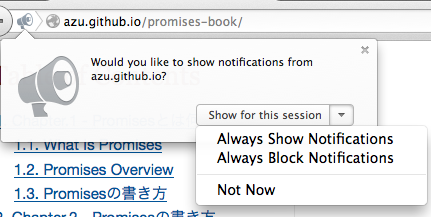

[[resolve-thenable]]
== Promise.resolveとThenable

<<ch2-promise-resolve,第二章のPromise.resolve>>にて、`Promise.resolve` の大きな特徴の一つとしてthenableなオブジェクトを変換する機能について紹介しました。

このセクションでは、thenableなオブジェクトからpromiseオブジェクトに変換してどのように利用するかについて学びたいと思います。

=== Web Notificationsをthenableにする

https://developer.mozilla.org/ja/docs/Web/API/notification[Web Notifications]という
デスクトップ通知を行うAPIを例に考えてみます。

Web Notifications APIについて詳しくは以下を参照して下さい。

* https://developer.mozilla.org/ja/docs/WebAPI/Using_Web_Notifications[Web Notifications の使用 - WebAPI | MDN]
* https://caniuse.com/notifications[Can I use Web Notifications]

Web Notifications APIについて簡単に解説すると、以下のように `new Notification` をすることで通知メッセージが表示できます。

[source,javascript]
new Notification("Hi!");

しかし、通知を行うためには、`new Notification` をする前にユーザーに許可を取る必要があります。

.Notificationの許可ダイアログ

この許可ダイアログで選択した結果は、`Notification.permission` に入りますが、
値は許可("granted")か不許可("denied")の2種類です。

[NOTE]
Notificationのダイアログの選択肢は、
Firefoxだと許可、不許可に加えて __永続__ か __セッション限り__ の組み合わせがありますが、値自体は同じです。

許可ダイアログは `Notification.requestPermission()` を実行すると表示され、
ユーザーが選択した結果がコールバック関数の `status` に渡されます。

コールバック関数を受け付けることから分かるように、この許可、不許可は非同期的に行われます。

[role="executable"]
[source,javascript]
----
Notification.requestPermission((status) => {
    // statusに"granted" or "denied"が入る
    console.log(status);
});
----

通知を行うまでの流れをまとめると以下のようになります。

* ユーザーに通知の許可を受け付ける非同期処理がある
* 許可がある場合は `new Notification` で通知を表示できる
** すでに許可済みのケース
** その場で許可を貰うケース
* 許可がない場合は何もしない

いくつかのパターンが出ますが、最終的には許可か不許可になるので、以下の2パターンにまとめることができます。

許可時("granted"):::
    `new Notification` で通知を作成
不許可時("denied"):::
    何もしない

この2パターンはどこかで見たことがありますね。
そう、PromiseのFulfilled または Rejected となった時の動作で書くことが出来そうな気がします。

resolve(成功)した時 == 許可時("granted")::
    `onFulfilled` が呼ばれる
reject(失敗)した時 == 不許可時("denied")::
    `onRejected`  が呼ばれる

Promiseで書けそうな目処が見えた所で、まずはコールバックスタイルで書いてみましょう。

=== Web Notification ラッパー

まずは先ほどのWeb Notification APIのラッパー関数をコールバックスタイルで書くと次のように書くことができます。

[role="executable"]
[source,javascript]
[[notification-callback.js]]
.notification-callback.js
----
include::embed/embed-notification-callback.js[]
// 実行例
// 第二引数は `Notification` に渡すオプションオブジェクト
notifyMessage("Hi!", {}, function (error, notification) {
    if(error){
        console.error(error);
        return;
    }
    console.log(notification);// 通知のオブジェクト
});
----

コールバックスタイルでは、許可がない場合は `error` に値が入り、
許可がある場合は通知が行われて `notification` に値が入ってくるという感じにしました。

[source,javascript]
.コールバック関数はエラーとnotificationオブジェクトを受け取る
----
function callback(error, notification) {

}
----

次に、このコールバックスタイルの関数をPromiseとして使える関数を書いてみたいと思います。

[NOTE]
====
https://notifications.spec.whatwg.org/[Notifications API]の最新仕様では、
コールバック関数を渡さなかった場合にpromiseオブジェクトを返すようになっています。
そのため、ここから先の話は最新の仕様ではもっとシンプルに書ける可能性があります。

しかし、古いNotification APIの仕様では、コールバック関数のみしか扱う方法がありませんでした。
ここではコールバック関数のみしか扱えないNotification APIを前提にしています。
====

=== Web Notification as Promise

先ほどのコールバックスタイルの `notifyMessage` とは別に、
promiseオブジェクトを返す `notifyMessageAsPromise` を定義してみます。

[role="executable"]
[source,javascript]
[[notification-as-promise.js]]
.notification-as-promise.js
----
include::embed/embed-notification-as-promise.js[]
// 実行例
notifyMessageAsPromise("Hi!").then(function (notification) {
    console.log(notification);// 通知のオブジェクト
}).catch((error) => {
    console.error(error);
});
----

上記の実行例では、許可がある場合 `"Hi!"` という通知が表示されます。

許可されている場合は `.then` が呼ばれ、
不許可となった場合は `.catch` が呼ばれます。

[NOTE]
====
ブラウザはWeb Notifications APIの状態をサイトごとに許可状態を記憶できるため、
実際には以下の4つのパターンが存在します。

すでに許可されている::
    `.then` が呼ばれる
許可ダイアログがでて許可された::
    `.then` が呼ばれる
すでに不許可となっている::
    `.catch` が呼ばれる
許可ダイアログが出て不許可となった::
    `.catch` が呼ばれる

つまり、Web Notifications APIをそのまま扱うと、4つのパターンについて書かないといけませんが、
それを2パターンにできるラッパーを書くと扱いやすくなります。
====

上記の<<notification-as-promise.js>>は、とても便利そうですが実際に使うときには
**Promiseをサポートしてない環境では使えない**という問題があります。

<<notification-as-promise.js>>のようなPromiseスタイルで使えるライブラリを作る場合、
ライブラリ作成者には以下の選択肢があると思います。

[[promise-library-choice]]
Promiseが使える環境を前提とする::
* 利用者に `Promise` があることを保証してもらう
* Promiseをサポートしてない環境では動かないことにする
ライブラリ自体に `Promise` の実装を入れてしまう::
* ライブラリ自体にPromiseの実装を取り込む
* 例) https://github.com/mozilla/localForage[localForage]
コールバックでも `Promise` でも使えるようにする::
* 利用者がどちらを使うかを選択できるようにする
* Thenableを返せるようにする

<<notification-as-promise.js>>は `Promise` があることを前提としたような書き方です。

本題に戻り<<Thenable,Thenable>>はここでいう**コールバックでも `Promise` でも使えるようにする**ということを
実現するのに役立つ概念です。

=== Web Notifications As Thenable

<<Thenable,thenable>>というのは `.then` というメソッドを持ってるオブジェクトのことを言いましたね。
次は<<notification-callback.js>>に `thenable` を返すメソッドを追加してみましょう。

[role="executable"]
[source,javascript]
[[notification-thenable.js]]
.notification-thenable.js
----
include::embed/embed-notification-thenable.js[]
// 実行例
Promise.resolve(notifyMessageAsThenable("message")).then(function (notification) {
    console.log(notification);// 通知のオブジェクト
}).catch((error) => {
    console.error(error);
});
----

<<notification-thenable.js>> には `notifyMessageAsThenable` というそのままのメソッドを追加してみました。
返すオブジェクトには `then` というメソッドがあります。

`then` メソッドの仮引数には `new Promise(function (resolve, reject){})` と同じように、
解決した時に呼ぶ `resolve` と、棄却した時に呼ぶ `reject` が渡ります。

`then` メソッドがやっている中身は<<notification-as-promise.js>>の `notifyMessageAsPromise` と同じですね。

この `thenable` を `Promise.resolve(thenable)` を使いpromiseオブジェクトにしてから、
Promiseとして利用していることが分かりますね。

[source,javascript]
----
Promise.resolve(notifyMessageAsThenable("message")).then((notification) => {
    console.log(notification);// 通知のオブジェクト
}).catch((error) => {
    console.error(error);
});
----

Thenableを使った<<notification-thenable.js>>とPromiseに依存した<<notification-as-promise.js>>は、
非常に似た使い方ができることがわかります。

<<notification-thenable.js>>には<<notification-as-promise.js>>と比べた時に、次のような違いがあります。

* ライブラリ側に `Promise` 実装そのものはでてこない
** 利用者が `Promise.resolve(thenable)` を使い `Promise` の実装を与える
* Promiseとして使う時に `Promise.resolve(thenable)` と一枚挟む必要がある

<<Thenable,Thenable>>オブジェクトを利用することで、
既存のコールバックスタイルとPromiseスタイルの中間的な実装をすることができました。

=== まとめ

このセクションではThenableとは何かやThenableを `Promise.resolve(thenable)` を使って、
promiseオブジェクトとして利用する方法について学びました。

Callback -- Thenable -- Promise

Thenableスタイルは、コールバックスタイルとPromiseスタイルの中間的な表現で、
ライブラリが公開するAPIとしては中途半端なためあまり見かけることがないと思います。

Thenable自体は `Promise` という機能に依存してはいませんが、Promise以外からの利用方法は特にないため、
間接的にはPromiseに依存しています。

また、使うためには利用者が `Promise.resolve(thenable)` について理解している必要があるため、
ライブラリの公開APIとしては難しい部分があります。
Thenable自体は公開APIより、内部的に使われてるケースが多いでしょう。

[NOTE]
====
非同期処理を行うライブラリを書く際には、まずはコールバックスタイルの関数を書いて公開APIとすることをオススメします。

Node.jsのCore moduleがこの方法をとっているように、ライブラリが提供するのは基本となるコールバックスタイル関数としたほうが、
利用者がPromiseやGenerator等の好きな方法で実装ができるためです。

最初からPromiseで利用することを目的としたライブラリや、その機能がPromiseに依存している場合は、
promiseオブジェクトを返す関数を公開APIとしても問題ないと思います。
====

==== Thenableの使われているところ

では、どのような場面でThenableは使われてるのでしょうか?

恐らく、一番多く使われている所は<<promise-library,Promiseのライブラリ>>間での相互変換でしょう。

たとえば、 QライブラリのPromiseのインスタンスであるQ promiseオブジェクトは、
<<es-promises,ES Promises>>のpromiseオブジェクトが持っていないメソッドを持っています。
Q promiseオブジェクトには `promise.finally(callback)` や `promise.nodeify(callback)` などのメソッドが用意されてます。

ES PromisesのpromiseオブジェクトをQ promiseオブジェクトに変換するときに使われるのが、
まさにこのThenableです。

[source,javascript]
.thenableを使ってQ promiseオブジェクトにする
----
const Q = require("Q");
// このpromiseオブジェクトはESのもの
const promise = new Promise((resolve) => {
    resolve(1);
});
// Q promiseオブジェクトに変換する
Q(promise).then((value) => {
    console.log(value);
}).finally(() => { // <1>
    console.log("finally");
});
----
<1> Q promiseオブジェクトとなったため `finally` が利用できる

最初に作成したpromiseオブジェクトは `then` というメソッドを持っているので、もちろんThenableです。
`Q(thenable)` とすることでThenableなオブジェクトをQ promiseオブジェクトへと変換することができます。

これは、`Promise.resolve(thenable)` と同じ仕組みといえるので、もちろん逆も可能です。

このように、Promiseライブラリはそれぞれ独自に拡張したpromiseオブジェクトを持っていますが、
Thenableという共通の概念を使うことでライブラリ間(もちろんネイティブPromiseも含めて)で相互にpromiseオブジェクトを変換することができます。

このようにThenableが使われる所の多くはライブラリ内部の実装であるため、あまり目にする機会はないかもしれません。
しかしこのThenableはPromiseでも大事な概念であるため知っておくとよいでしょう。
